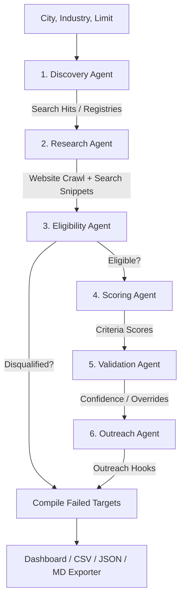

# Federer Company Discovery Engine 🎾

The **Federer Company Discovery Engine** is a production-ready, multi-agent AI system designed to automatically discover, research, score, and validate Indian companies against DeepThought's "Federer" Ideal Customer Profile (ICP).

A **Federer company** is a Rs. 50Cr - Rs. 500Cr revenue organization in India with a growth mindset and an operator/scientist-founder who actively invests in building in-house capability, R&D, and systems rather than outsourcing or wealth-preservation.

---

## 🌟 Features
- **Multi-Agent Coordination**: Uses **LangGraph** to coordinate 6 specialized agents in an asynchronous pipeline.
- **Provider Abstraction Layer**: Run on cloud APIs or offline local models with a single setting.
- **Deep Web Crawling**: Uses **Playwright** with **BeautifulSoup** fallbacks to scrape text from company websites (Homepage, About Us, Products, careers, etc.).
- **Registry and Search Heuristics**: Automatically queries Google/DuckDuckGo for registry entries (ZaubaCorp, Tofler) and secondary sources, filtering directory noise.
- **Strict Validation**: Fact-checks and validation confidence scores to prevent LLM hallucinations.
- **Personalized Outreach**: Generates tailored email hooks based on specific company achievements, machinery, or R&D milestones.
- **Streamlit Dashboard**: A premium, interactive UI for pipeline execution, live logs, scoring inspection, and data exports.
- **Exporters**: Downloads prospects in exact CSV schemas, full metadata JSON dumps, or rich Markdown Reports.

---

## 🏗️ Architecture & Multi-Agent Design

The engine is built on a modular multi-agent graph coordination layer:



### The 6 Specialized Agents
1. **Discovery Agent**: Formulates search queries targeting registries (ZaubaCorp, Tofler), trade directories, and expos. Deduplicates company candidates and resolves missing website URLs using secondary searches.
2. **Research Agent**: Crawls target websites up to 4 pages and compiles additional facts via web searches (e.g. founder background, revenue news, facilities).
3. **Eligibility Agent**: Audits E1 (Producer) and E2 (Accessible) gates, auto-rejecting CROs, traders, distributors, and subsidiaries.
4. **Scoring Agent**: Evaluates criteria C3-C8 on standard weights (Weak: 0, Moderate: half-weight, Strong: full weight).
5. **Validation Agent**: Fact-checks LLM scores against source data, flags weak evidence, and applies programmatic score overrides.
6. **Outreach Agent**: Generates one context-rich, personalized email hook using specific company accomplishments.

---

## 📊 Scoring Framework

The engine implements the exact scoring criteria specified by DeepThought:

| Gate / Criterion | Description | Max Score | Scoring Options |
|---|---|---|---|
| **E1 Gate** | **Producer** | Mandatory | PASS / FAIL (Traders, CROs, Distributors fail) |
| **E2 Gate** | **Accessible** | Mandatory | PASS / FAIL (India-based operations required) |
| **C3 Criterion** | **Differentiated** | 20 points | Strong (20) / Moderate (10) / Weak (0) |
| **C4 Criterion** | **Decision Maker Quality** | 15 points | Strong (15) / Moderate (7.5) / Weak (0) |
| **C5 Criterion** | **Growing Sector** | 15 points | Strong (15) / Moderate (7.5) / Weak (0) |
| **C6 Criterion** | **Growth Signals** | 15 points | Strong (15) / Moderate (7.5) / Weak (0) |
| **C7 Criterion** | **Systems Maturity** | 20 points | Strong (20) / Moderate (10) / Weak (0) |
| **C8 Criterion** | **Leadership Succession** | 15 points | Strong (15) / Moderate (7.5) / Weak (0) |

### Score Bands
- **Band A (80-100)**: Strong Federer (High Priority target)
- **Band B (60-79)**: Probable Federer (Fit, target)
- **Band C (40-59)**: Borderline (May have hidden disqualifier)
- **Band D (<40)**: Not ICP / Disqualified

---

## 🤖 LLM Provider Setup & Configuration

All agents utilize standard LangChain integrations, managed via `src/providers/factory.py`. The active provider is loaded from environment configuration (`LLM_PROVIDER` in `.env`) or overridden directly in the Streamlit Sidebar.

### 📋 Environment Variables Template
Copy `.env.example` to `.env` and fill in the parameters for the active provider:
```env
LLM_PROVIDER=gemini  # Options: gemini, groq, ollama

GOOGLE_API_KEY=AIzaSy...
GROQ_API_KEY=gsk_...
OLLAMA_BASE_URL=http://localhost:11434
OLLAMA_MODEL=qwen3:8b
```

---

### 1. ♊ Gemini Setup (Primary - Recommended)
Gemini is the recommended default model. It provides a generous free tier via Google AI Studio that easily handles hundreds of research queries.
- **Model**: `gemini-2.5-flash` (fast, structured JSON, async support)
- **Installation**: Handled automatically (`langchain-google-genai`)
- **Key Configuration**:
  1. Generate an API key from [Google AI Studio](https://aistudio.google.com/).
  2. Set `GOOGLE_API_KEY` in your `.env` file or enter it in the Streamlit Sidebar.

---

### 2. ⚡ Groq Setup (Secondary)
Groq provides fast cloud inference for open-weight models.
- **Model**: `llama-3.3-70b-versatile` (excellent analytical scoring)
- **Installation**: Handled automatically (`langchain-groq`)
- **Key Configuration**:
  1. Generate an API key from [Groq Console](https://console.groq.com/).
  2. Set `GROQ_API_KEY` in your `.env` file or enter it in the Streamlit Sidebar.

---

### 3. 🦙 Ollama Setup (Offline Fallback)
Ollama runs open-weight models locally on your machine without requiring an API key or an internet connection.
- **Model**: `qwen3:8b` (recommended default local model)
- **Fallback Models**: `llama3.1:8b`, `mistral`
- **Installation & Setup**:
  1. Download and install Ollama from [Ollama's Official Website](https://ollama.com/).
  2. Pull the default model from your terminal:
     ```bash
     ollama pull qwen3:8b
     ```
  3. Start the Ollama server:
     ```bash
     ollama serve
     ```
  4. Ensure `OLLAMA_BASE_URL` points to `http://localhost:11434` (default).

---

## 🔀 Automatic Fallback Logic
If an LLM call fails (e.g. rate limits or server timeouts), the engine triggers an automatic fallback chain:
1. **Gemini** fails → fallbacks to **Groq**.
2. **Groq** fails → fallbacks to local **Ollama** (offline local mode).
3. **Ollama** fails → raises an execution error.

If a provider in the chain has no API credentials configured, it will be skipped automatically to prevent connection timeouts.

---

## 📁 File Structure
```
deepthought_culture/
│
├── requirements.txt           # Python dependencies
├── setup.py                   # Automated dependency and model puller
├── test_system.py             # Diagnostics and validation checker
├── app.py                     # Streamlit web dashboard
├── .env.example               # Configuration environment variables template
│
└── src/                       # Source package
    ├── __init__.py
    ├── config.py              # Configuration manager
    ├── state.py               # Pydantic schemas and GraphState TypedDict
    ├── graph.py               # LangGraph workflow coordination graph
    │
    ├── providers/             # LLM Provider Abstraction
    │   ├── __init__.py
    │   ├── base.py            # Abstract BaseProvider interface
    │   ├── gemini_provider.py # Google Gemini provider
    │   ├── groq_provider.py   # Groq provider
    │   ├── ollama_provider.py # Local Ollama provider
    │   └── factory.py         # ProviderFactory selector
    │
    ├── agents/                # LLM Multi-Agent nodes
    │   ├── __init__.py
    │   ├── base.py            # Base agent with fallback and factory coordination
    │   ├── discovery.py       # Discovery Agent node
    │   ├── research.py        # Research Agent node
    │   ├── eligibility.py     # Eligibility Agent node
    │   ├── scoring.py         # Scoring Agent node
    │   ├── validation.py      # Validation Agent node
    │   └── outreach.py        # Outreach Agent node
    │
    └── utils/                 # Utilities
        ├── __init__.py
        ├── scraper.py         # Playwright crawler with BS4 fallbacks
        ├── search.py          # DuckDuckGo search connection and HTML parser
        └── export.py          # CSV, JSON, and Markdown report converters
```

---

## 🚀 Setup & Launch

Ensure you have Python 3.10+ installed.

### 1. Provision Dependencies
Run the setup script which will automatically install pip requirements, provision Playwright browser binaries, and pull local Ollama models (if Ollama is installed):
```bash
python setup.py
```

### 2. Launch Dashboard
```bash
streamlit run app.py
```
Open the printed URL (typically `http://localhost:8501`) in your browser to run the discovery engine.
